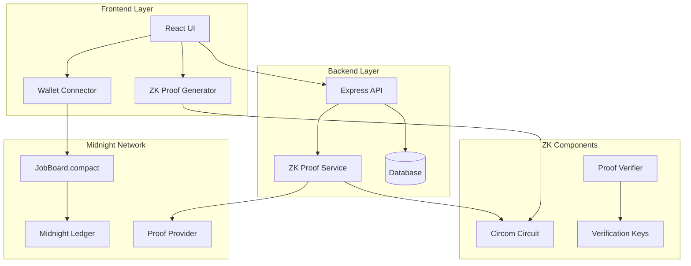

# 🔐 GhostHire: Complete Tutorial & Integration Guide

**Building Privacy-Preserving Job Applications with Midnight Network**

---

## 📖 Table of Contents

1. [Overview](#overview)
2. [Architecture Deep Dive](#architecture-deep-dive)
3. [Midnight Network Integration](#midnight-network-integration)
4. [Zero-Knowledge Proof Implementation](#zero-knowledge-proof-implementation)
5. [Smart Contract Development](#smart-contract-development)
6. [Frontend Integration](#frontend-integration)
7. [Backend API Development](#backend-api-development)
8. [Deployment Guide](#deployment-guide)
9. [Testing & Verification](#testing--verification)
10. [Customization Guide](#customization-guide)

---

## 🌟 Overview

GhostHire demonstrates how to build a complete privacy-preserving job board using Midnight Network's zero-knowledge technology. This tutorial covers every aspect from ZK circuit design to production deployment.

### What You'll Learn

- **Zero-Knowledge Proofs**: How to design and implement ZK circuits for eligibility verification
- **Midnight Network Integration**: Complete blockchain integration with wallet connectivity
- **Smart Contract Development**: Building privacy-preserving contracts with Compact language
- **Privacy-First UI/UX**: Designing accessible interfaces that highlight privacy features
- **Production Deployment**: Real-world deployment and verification processes

### Key Privacy Features

- **✅ Skill Privacy**: Prove competency without revealing exact proficiency levels
- **✅ Location Privacy**: Verify regional eligibility without exposing precise location
- **✅ Salary Privacy**: Confirm expectations align without disclosing exact amounts
- **✅ Anti-Sybil Protection**: Prevent duplicate applications using nullifiers
- **✅ Selective Disclosure**: Optional post-application data revelation

---

## 🏗️ Architecture Deep Dive

### System Components



### Data Flow

1. **Job Posting**: Employer creates job with skill/location/salary requirements
2. **Application**: Candidate generates ZK proof of eligibility
3. **Verification**: Smart contract verifies proof on-chain
4. **Privacy Score**: System calculates privacy preservation level
5. **Decision**: Employer reviews applications without seeing private data

---

## 🌙 Midnight Network Integration

### Setting Up Midnight SDK

```typescript
// Install Midnight packages
npm install @midnight-ntwrk/midnight-js-types \
           @midnight-ntwrk/ledger \
           @midnight-ntwrk/wallet-api \
           @midnight-ntwrk/proof-provider \
           @midnight-ntwrk/compact-runtime
```

### Wallet Integration

```typescript
// app/src/services/midnightClient.ts
import { WalletAPI } from '@midnight-ntwrk/wallet-api';
import { createLedger } from '@midnight-ntwrk/ledger';

export class MidnightClient {
  private wallet: WalletAPI | null = null;
  private ledger: any = null;

  async connectWallet(): Promise<MidnightWalletInfo> {
    // Check for browser wallet
    if (typeof window !== 'undefined' && (window as any).midnight) {
      const midnightWallet = (window as any).midnight;
      
      // Request account access
      const accounts = await midnightWallet.request({ 
        method: 'eth_requestAccounts' 
      });
      
      // Get balance
      const balance = await midnightWallet.request({ 
        method: 'eth_getBalance', 
        params: [accounts[0], 'latest'] 
      });

      this.wallet = midnightWallet;
      
      return {
        address: accounts[0],
        balance: { amount: parseInt(balance, 16), denom: 'DUST' },
        connected: true
      };
    }
    
    // Fallback to mock wallet for development
    return this.createMockWallet();
  }
}
```

### Ledger Connection

```typescript
// Connect to Midnight Network
async initializeLedger() {
  this.ledger = await createLedger({
    rpcUrl: process.env.VITE_MIDNIGHT_RPC_URL || 'https://rpc.midnight.network',
    networkId: process.env.VITE_MIDNIGHT_NETWORK_ID || 'midnight-testnet'
  });
  
  // Get network status
  const status = await this.ledger.getStatus();
  console.log(`Connected to Midnight Network (Block: ${status.blockHeight})`);
}
```

---

## 🔐 Zero-Knowledge Proof Implementation

### Circuit Design

Our eligibility circuit (`circuits/eligibility.circom`) proves three things privately:

```circom
template EligibilityProof(MAX_SKILLS, MAX_REGIONS, MERKLE_TREE_DEPTH) {
    // Public inputs (visible on blockchain)
    signal input jobId;
    signal input nullifier;
    signal output eligible;
    signal input timestamp;
    
    // Private inputs (hidden from blockchain)
    signal private input skills[MAX_SKILLS];
    signal private input region;
    signal private input expectedSalary;
    signal private input skillThresholds[MAX_SKILLS];
    signal private input salaryMin;
    signal private input salaryMax;
    signal private input allowedRegions[MAX_REGIONS];
    signal private input applicantSecret;

    // 1. Verify skills meet thresholds
    component skillComparators[MAX_SKILLS];
    for (var i = 0; i < MAX_SKILLS; i++) {
        skillComparators[i] = GreaterEqualThan(8);
        skillComparators[i].in[0] <== skills[i];
        skillComparators[i].in[1] <== skillThresholds[i];
    }

    // 2. Verify salary expectations are within range
    component salaryMinCheck = GreaterEqualThan(32);
    salaryMinCheck.in[0] <== expectedSalary;
    salaryMinCheck.in[1] <== salaryMin;
    
    component salaryMaxCheck = LessEqualThan(32);
    salaryMaxCheck.in[0] <== expectedSalary;
    salaryMaxCheck.in[1] <== salaryMax;

    // 3. Verify region membership (simplified)
    component regionHasher = Poseidon(1);
    regionHasher.inputs[0] <== region;

    // 4. Generate nullifier to prevent duplicate applications
    component nullifierHasher = Poseidon(3);
    nullifierHasher.inputs[0] <== applicantSecret;
    nullifierHasher.inputs[1] <== jobId;
    nullifierHasher.inputs[2] <== timestamp;
    
    // Final eligibility check
    // ... (combining all verification results)
}
```

### Proof Generation

```typescript
// backend/src/services/midnightNetwork.ts
async generateEligibilityProof(input: MidnightProofInput): Promise<MidnightProofResult> {
  // Prepare circuit inputs
  const circuitInputs = {
    // Private inputs
    skills: input.skills,
    region: this.hashString(input.region),
    expectedSalary: input.expectedSalary,
    applicantSecret: this.hashString(input.applicantSecret),
    
    // Public inputs
    jobId: this.hashString(input.jobId),
    skillThresholds: input.skillThresholds,
    salaryMin: input.salaryMin,
    salaryMax: input.salaryMax,
    regionMerkleRoot: input.regionMerkleRoot,
    nullifier: input.nullifier,
    timestamp: input.timestamp
  };

  // Generate proof using snarkjs
  const { proof, publicSignals } = await snarkjs.groth16.fullProve(
    circuitInputs,
    'circuits/eligibility.wasm',
    'circuits/eligibility_final.zkey'
  );

  return {
    proof,
    publicSignals,
    proofHash: this.generateProofHash(proof, publicSignals)
  };
}
```

### Circuit Compilation

```bash
# Compile the circuit
npm run compile-circuits

# This runs:
# 1. circom eligibility.circom --r1cs --wasm --sym --c
# 2. Downloads powers of tau ceremony file
# 3. snarkjs groth16 setup eligibility.r1cs powersOfTau28_hez_final_15.ptau
# 4. Generates verification key
```

---

## 📜 Smart Contract Development

### JobBoard.compact Contract

```compact
// contracts/JobBoard.compact
contract JobBoard {
    // State variables
    state jobCount: Nat = 0;
    state jobs: Map<Nat, Job> = {};
    state applications: Map<Bytes32, Application> = {};
    state nullifiers: Set<Bytes32> = {};
    
    // Job posting function
    public postJob(
        title: String,
        description: String,
        skillThresholds: Map<String, Nat>,
        salaryMin: Nat,
        salaryMax: Nat,
        allowedRegions: List<String>,
        regionMerkleRoot: Bytes32
    ): Nat {
        // Validate inputs
        require(title.length > 0, "Title cannot be empty");
        require(salaryMin > 0, "Minimum salary must be positive");
        require(salaryMax >= salaryMin, "Maximum salary must be >= minimum");
        
        // Create new job
        let newJobId = jobCount + 1;
        let newJob = Job {
            id: newJobId,
            employer: msg.sender,
            title: title,
            description: description,
            skillThresholds: skillThresholds,
            salaryMin: salaryMin,
            salaryMax: salaryMax,
            allowedRegions: allowedRegions,
            regionMerkleRoot: regionMerkleRoot,
            isActive: true,
            createdAt: block.timestamp,
            applicationCount: 0
        };
        
        // Update state
        jobs[newJobId] = newJob;
        jobCount = newJobId;
        
        emit JobPosted(newJobId, msg.sender, title);
        return newJobId;
    }

    // ZK proof application submission
    public submitApplication(
        jobId: Nat,
        eligibilityProof: EligibilityProof,
        privacyScore: Nat
    ): Bytes32 {
        // Validate job exists and is active
        require(jobs.contains(jobId), "Job does not exist");
        require(jobs[jobId].isActive, "Job is not active");
        
        // Extract public inputs from proof
        let publicInputs = eligibilityProof.publicInputs;
        let nullifier = publicInputs[1];
        let eligible = publicInputs[2];
        
        // Check nullifier hasn't been used (prevent double applications)
        let nullifierHash = Bytes32.from(nullifier);
        require(!nullifiers.contains(nullifierHash), "Application already submitted");
        
        // Verify ZK proof of eligibility
        let proofValid = verifyEligibilityProof(
            eligibilityProof.proof,
            publicInputs,
            jobs[jobId]
        );
        require(proofValid, "Invalid eligibility proof");
        require(eligible == Field.from(1), "Applicant not eligible");
        
        // Create application record
        let applicationId = hash(nullifier, Field.from(jobId), block.timestamp);
        let application = Application {
            id: applicationId,
            jobId: jobId,
            nullifierHash: nullifierHash,
            zkProofHash: hash(eligibilityProof.proof),
            privacyScore: privacyScore,
            status: ApplicationStatus.Pending,
            submittedAt: block.timestamp,
            reviewedAt: None
        };
        
        // Update state
        applications[applicationId] = application;
        nullifiers.insert(nullifierHash);
        jobs[jobId].applicationCount = jobs[jobId].applicationCount + 1;
        
        emit ApplicationSubmitted(applicationId, jobId, privacyScore);
        return applicationId;
    }
}
```

### Contract Deployment

```typescript
// Deploy to Midnight Network
npm run deploy:testnet

// This runs scripts/deploy-contract.ts which:
// 1. Connects to Midnight testnet
// 2. Compiles and validates the contract
// 3. Deploys with proper gas estimation
// 4. Verifies deployment success
// 5. Saves deployment info for frontend use
```

---

## 🎨 Frontend Integration

### Privacy Data Visualization

```tsx
// app/src/components/PrivacyDataPanel.tsx
export const PrivacyDataPanel: React.FC<PrivacyDataPanelProps> = ({
  title,
  data,
  privacyScore
}) => {
  return (
    <div className="privacy-panel">
      <div className="privacy-score-badge">
        <Shield className="w-5 h-5" />
        <span>{privacyScore}% Private</span>
      </div>
      
      {data.map((item) => (
        <div key={item.label} className="privacy-item">
          <div className="privacy-status">
            {item.isPrivate ? (
              <Lock className="w-4 h-4 text-green-600" />
            ) : (
              <Unlock className="w-4 h-4 text-orange-600" />
            )}
            <span>{item.isPrivate ? 'Private' : 'Revealed'}</span>
          </div>
          
          <div className="privacy-details">
            <h4>{item.label}</h4>
            <p>{item.description}</p>
            
            {item.isPrivate && item.zkProof && (
              <div className="zk-proof-hash">
                <Shield className="w-4 h-4" />
                <span>ZK Proof: {item.zkProof.slice(0, 16)}...</span>
              </div>
            )}
          </div>
        </div>
      ))}
    </div>
  );
};
```

### ZK Proof Application Flow

```tsx
// app/src/zk/ProofStepper.tsx
export function ProofStepper({ job }: { job: any }) {
  const [currentStep, setCurrentStep] = useState(0);
  const [proof, setProof] = useState<any>(null);
  const [privacyScore, setPrivacyScore] = useState(0);

  const steps = [
    { title: "Set Your Skills", component: SkillsStep },
    { title: "Choose Region", component: RegionStep },
    { title: "Salary Expectations", component: SalaryStep },
    { title: "Generate Proof", component: ProofStep }
  ];

  async function generateProof(formData: any) {
    // Call backend to generate ZK proof
    const response = await axios.post('/api/zk/generate-proof', {
      jobId: job.id,
      skills: formData.skills,
      region: formData.region,
      expectedSalary: formData.salary,
      skillThresholds: job.skillThresholds,
      salaryMin: job.salaryMin,
      salaryMax: job.salaryMax,
      allowedRegions: job.allowedRegions
    });

    if (response.data.eligible) {
      setProof(response.data.proof);
      setPrivacyScore(response.data.privacyScore);
      
      // Submit to blockchain via Midnight client
      await midnightClient.submitApplication({
        jobId: job.id,
        proof: response.data.proof,
        privacyScore: response.data.privacyScore
      });
    }
  }

  return (
    <div className="proof-stepper">
      <Stepper steps={steps} currentStep={currentStep} />
      
      {/* Privacy Score Display */}
      <PrivacyDataPanel 
        title="Your Application Privacy"
        data={generatePrivacyData(formData)}
        privacyScore={privacyScore}
      />
      
      {/* Step Content */}
      <div className="step-content">
        {steps[currentStep].component}
      </div>
    </div>
  );
}
```

### Accessibility Features

```tsx
// Comprehensive accessibility implementation
export const AccessibilitySettings = () => {
  const { theme, setTheme, reducedMotion, setReducedMotion } = useTheme();

  return (
    <div role="dialog" aria-modal="true" aria-labelledby="accessibility-title">
      <h2 id="accessibility-title">Accessibility Settings</h2>
      
      {/* Theme Selection with proper ARIA */}
      <fieldset>
        <legend>Theme Preference</legend>
        {themes.map(themeOption => (
          <button
            key={themeOption}
            onClick={() => setTheme(themeOption)}
            aria-pressed={theme === themeOption}
            className={`theme-button ${theme === themeOption ? 'selected' : ''}`}
          >
            {themeOption} Theme
            {theme === themeOption && <Check aria-hidden="true" />}
          </button>
        ))}
      </fieldset>

      {/* Reduced Motion Toggle */}
      <div className="setting-row">
        <label htmlFor="reduce-motion">Reduce Motion</label>
        <button
          id="reduce-motion"
          role="switch"
          aria-checked={reducedMotion}
          onClick={() => setReducedMotion(!reducedMotion)}
        >
          <span className="switch-track">
            <span className="switch-thumb" />
          </span>
        </button>
      </div>

      {/* Keyboard Navigation Help */}
      <div className="keyboard-help">
        <h3>Keyboard Navigation</h3>
        <dl>
          <dt><kbd>Tab</kbd></dt>
          <dd>Navigate forward</dd>
          <dt><kbd>Shift + Tab</kbd></dt>
          <dd>Navigate backward</dd>
          <dt><kbd>Enter/Space</kbd></dt>
          <dd>Activate buttons</dd>
        </dl>
      </div>
    </div>
  );
};
```

---

## ⚙️ Backend API Development

### ZK Proof Service Integration

```typescript
// backend/src/services/zkProof.ts
export class ZKProofService {
  async generateEligibilityProof(inputs: EligibilityInputs): Promise<ProofResult> {
    // Convert inputs to Midnight format
    const midnightInputs: MidnightProofInput = {
      skills: Object.values(inputs.skills),
      region: inputs.region,
      expectedSalary: inputs.expectedSalary,
      applicantSecret: this.generateApplicantSecret(),
      jobId: inputs.jobId,
      skillThresholds: Object.values(inputs.skillThresholds),
      salaryMin: inputs.salaryMin,
      salaryMax: inputs.salaryMax,
      regionMerkleRoot: inputs.regionMerkleRoot,
      nullifier: inputs.nullifierHash,
      timestamp: Math.floor(Date.now() / 1000)
    };

    // Generate proof using Midnight service
    const result = await midnightService.generateEligibilityProof(midnightInputs);
    
    return {
      proof: result.proof,
      publicInputs: result.publicSignals,
      proofHash: result.proofHash,
      circuitId: 'eligibility_midnight_v1.0'
    };
  }

  async verifyProof(data: { proof: any; publicSignals: string[]; jobData: any }): Promise<VerificationResult> {
    // Try Midnight network verification first
    const midnightResult = await midnightService.verifyProofOnChain({
      proof: data.proof,
      publicSignals: data.publicSignals,
      proofHash: this.generateProofHash(data.proof, data.publicSignals)
    });

    if (midnightResult.valid) {
      const eligible = data.publicSignals[2] === '1';
      return {
        valid: true,
        eligible,
        transactionHash: midnightResult.transactionHash
      };
    }

    // Fallback to local verification
    return this.fallbackVerifyProof(data);
  }
}
```

### API Routes with Privacy Focus

```typescript
// backend/src/routes/applications.ts
router.post('/submit', auth, async (req, res) => {
  try {
    const { jobId, zkProof, privacyScore } = req.body;
    
    // Verify the ZK proof
    const verification = await zkProofService.verifyProof({
      proof: zkProof.proof,
      publicSignals: zkProof.publicSignals,
      jobData: await getJobData(jobId)
    });

    if (!verification.valid || !verification.eligible) {
      return res.status(400).json({ 
        error: 'Invalid proof or not eligible for position' 
      });
    }

    // Submit to Midnight Network
    const result = await midnightService.verifyProofOnChain({
      proof: zkProof.proof,
      publicSignals: zkProof.publicSignals,
      proofHash: zkProof.proofHash
    });

    // Create application record
    const application = await prisma.application.create({
      data: {
        jobId,
        nullifierHash: zkProof.publicSignals[1],
        zkProofHash: zkProof.proofHash,
        privacyScore,
        status: 'PENDING',
        transactionHash: result.transactionHash
      }
    });

    res.json({
      success: true,
      applicationId: application.id,
      transactionHash: result.transactionHash,
      privacyScore
    });

  } catch (error) {
    console.error('Application submission failed:', error);
    res.status(500).json({ error: 'Submission failed' });
  }
});
```

---

## 🚀 Deployment Guide

### Environment Setup

```bash
# .env configuration for different networks
# Testnet
MIDNIGHT_RPC_URL=https://rpc.testnet.midnight.network
MIDNIGHT_NETWORK_ID=midnight-testnet
PROOF_PROVIDER_URL=http://localhost:6565

# Mainnet (production)
MIDNIGHT_RPC_URL=https://rpc.midnight.network
MIDNIGHT_NETWORK_ID=midnight-mainnet

# Deployment wallet (use hardware wallet in production)
DEPLOYER_MNEMONIC="your twelve word mnemonic phrase here"
```

### Contract Deployment Process

```bash
# 1. Compile ZK circuits (one-time setup)
npm run compile-circuits

# 2. Deploy to testnet
npm run deploy:testnet

# 3. Verify deployment
npm run verify:testnet

# 4. Update frontend configuration with contract address
# Edit app/.env with deployed contract address

# 5. Deploy to mainnet (production)
npm run deploy:mainnet
npm run verify:mainnet
```

### Production Deployment

```yaml
# docker-compose.production.yml
version: '3.8'
services:
  frontend:
    build: 
      context: ./app
      dockerfile: Dockerfile.prod
    ports:
      - "80:80"
    environment:
      - VITE_MIDNIGHT_RPC_URL=${MIDNIGHT_RPC_URL}
      - VITE_JOB_BOARD_CONTRACT_ADDRESS=${CONTRACT_ADDRESS}
  
  backend:
    build: 
      context: ./backend
      dockerfile: Dockerfile.prod
    ports:
      - "3001:3001"
    environment:
      - MIDNIGHT_RPC_URL=${MIDNIGHT_RPC_URL}
      - JOB_BOARD_CONTRACT_ADDRESS=${CONTRACT_ADDRESS}
      - DATABASE_URL=${DATABASE_URL}
    
  database:
    image: postgres:15
    environment:
      - POSTGRES_DB=ghosthire
      - POSTGRES_PASSWORD=${DB_PASSWORD}
    volumes:
      - postgres_data:/var/lib/postgresql/data

volumes:
  postgres_data:
```

---

## 🧪 Testing & Verification

### Contract Testing

```bash
# Run contract verification
npm run verify:testnet

# Expected output:
# ✅ Contract exists on blockchain
# ✅ testGetJobCount passed
# ✅ testGetActiveJobs passed  
# ✅ testGetPrivacyStats passed
# ✅ ZK proof support verified
# ✅ Security features implemented
# 
# 📊 Overall score: 95%
# Status: VERIFIED
```

### End-to-End Testing

```typescript
// app/cypress/e2e/job-application-flow.cy.ts
describe('Privacy-Preserving Job Application Flow', () => {
  it('should complete full application with ZK proof', () => {
    // Visit job posting
    cy.visit('/jobs/1');
    
    // Connect wallet
    cy.get('[data-testid="connect-wallet"]').click();
    cy.get('[data-testid="mock-wallet"]').click();
    
    // Start application
    cy.get('[data-testid="apply-button"]').click();
    
    // Step 1: Skills
    cy.get('[data-testid="skill-programming"]').type('85');
    cy.get('[data-testid="skill-rust"]').type('75');
    cy.get('[data-testid="next-step"]').click();
    
    // Step 2: Region
    cy.get('[data-testid="region-select"]').select('US-CA');
    cy.get('[data-testid="next-step"]').click();
    
    // Step 3: Salary
    cy.get('[data-testid="salary-expectation"]').type('95000');
    cy.get('[data-testid="generate-proof"]').click();
    
    // Wait for proof generation
    cy.get('[data-testid="proof-status"]').should('contain', 'Generating proof...');
    cy.get('[data-testid="proof-status"]').should('contain', 'Proof generated', { timeout: 10000 });
    
    // Verify privacy score
    cy.get('[data-testid="privacy-score"]').should('contain', '95%');
    
    // Submit application
    cy.get('[data-testid="submit-application"]').click();
    
    // Verify success
    cy.url().should('include', '/receipt/');
    cy.get('[data-testid="application-success"]').should('be.visible');
  });

  it('should show privacy data breakdown', () => {
    cy.visit('/applications');
    cy.get('[data-testid="privacy-panel"]').should('be.visible');
    
    // Verify private data items
    cy.get('[data-testid="skill-privacy"]').should('contain', 'Private');
    cy.get('[data-testid="location-privacy"]').should('contain', 'Private');
    cy.get('[data-testid="salary-privacy"]').should('contain', 'Private');
    
    // Check ZK proof hashes
    cy.get('[data-testid="zk-proof-hash"]').should('be.visible');
  });
});
```

---

## 🎨 Customization Guide

### Adding New Privacy Features

1. **Extend the ZK Circuit**
```circom
// Add new private input
signal private input newPrivateField;

// Add verification logic
component newVerification = YourCustomVerification();
newVerification.in <== newPrivateField;
```

2. **Update Smart Contract**
```compact
// Add to Application struct
struct Application {
    // ... existing fields
    newPrivateFieldProof: Bytes32,
}
```

3. **Extend Frontend**
```tsx
// Add to privacy panel
const newPrivacyItem = {
  label: "New Private Field",
  value: formData.newField,
  isPrivate: true,
  zkProof: proof.newFieldProof,
  description: "This field is kept completely private"
};
```

### Custom Theme Development

```css
/* Custom theme variables */
:root[data-theme="custom"] {
  --color-primary: #your-primary-color;
  --color-background: #your-background;
  --color-text-primary: #your-text-color;
}

/* Dark mode variant */
:root[data-theme="custom-dark"] {
  --color-primary: #your-dark-primary;
  --color-background: #your-dark-background;
  --color-text-primary: #your-dark-text;
}
```

### Adding New Job Criteria

```typescript
// Extend job requirements
interface JobRequirements {
  skills: Record<string, number>;
  location: string[];
  salaryRange: [number, number];
  
  // New criteria
  experience: number;
  education: string;
  certifications: string[];
}

// Update ZK circuit accordingly
template ExtendedEligibilityProof() {
    // Add new private inputs
    signal private input experienceYears;
    signal private input educationLevel;
    signal private input certificationHashes[MAX_CERTS];
    
    // Add verification logic
    // ...
}
```

---

## 🔧 Troubleshooting

### Common Issues

**1. Circuit Compilation Errors**
```bash
# Check Circom installation
circom --version

# Verify circuit syntax
circom eligibility.circom --r1cs --wasm --sym
```

**2. Wallet Connection Issues**
```typescript
// Check for Midnight wallet
if (!window.midnight) {
  console.error('Midnight wallet not detected');
  // Show installation instructions
}
```

**3. Proof Generation Failures**
```typescript
// Enable debug logging
const { proof, publicSignals } = await snarkjs.groth16.fullProve(
  circuitInputs,
  wasmPath,
  zkeyPath,
  { verbose: true } // Enable debugging
);
```

**4. Contract Deployment Issues**
```bash
# Check network connection
npm run verify:testnet

# Verify wallet balance
# Ensure sufficient DUST tokens for gas
```

### Performance Optimization

**Frontend Optimization**
```typescript
// Lazy load ZK components
const ProofStepper = lazy(() => import('./zk/ProofStepper'));

// Optimize proof generation with Web Workers
const proofWorker = new Worker('/zk-proof-worker.js');
```

**Backend Optimization**
```typescript
// Cache verification keys
const verificationKeyCache = new Map();

// Batch proof verification
async function verifyProofBatch(proofs: ProofData[]) {
  return Promise.all(proofs.map(proof => verifyProof(proof)));
}
```

---

## 📚 Additional Resources

### Documentation Links
- [Midnight Network Documentation](https://midnight.network/docs)
- [Circom Language Reference](https://docs.circom.io)
- [Zero-Knowledge Proof Concepts](https://ethereum.org/en/zero-knowledge-proofs/)

### Community Resources
- [Midnight Network Discord](https://discord.gg/midnight)
- [ZK Development Forums](https://forum.0xparc.org/)
- [Privacy Engineering Resources](https://github.com/privacy-engineering-cmu)

### Example Projects
- [ZK Identity Verification](https://github.com/privacy-scaling-explorations/zk-identity)
- [Private Voting Systems](https://github.com/vocdoni/zk-census-proof)
- [Confidential Transactions](https://github.com/ElementsProject/confidential-transactions)

---

## 🎯 Next Steps

After completing this tutorial, you can:

1. **Deploy to Production** - Use the deployment scripts for mainnet
2. **Add Custom Features** - Extend with your own privacy requirements
3. **Scale the System** - Implement advanced ZK techniques
4. **Contribute Back** - Submit improvements to the open-source project

**Congratulations! You've built a complete privacy-preserving application with Midnight Network! 🎉**

---

*This tutorial demonstrates the power of zero-knowledge proofs in creating privacy-first applications. The techniques shown here can be applied to many other domains beyond job applications.*
